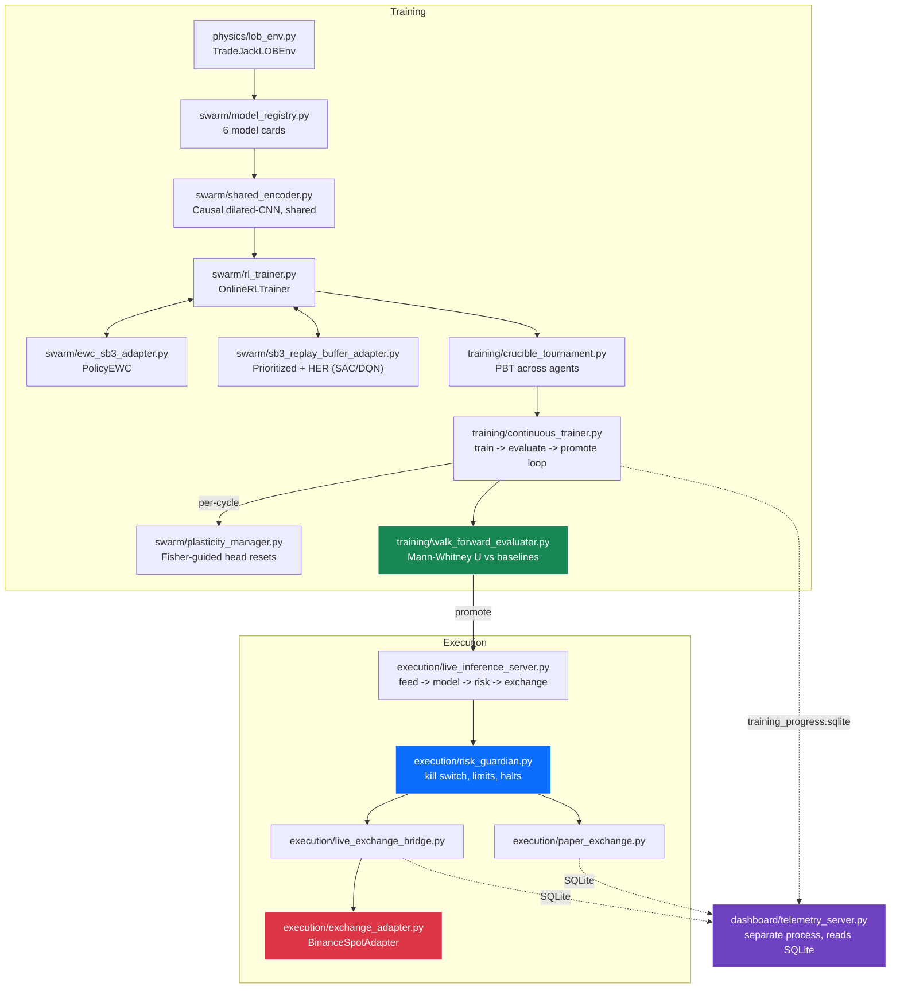

# TradeJack Architecture

*This document describes the system as it actually runs today, verified by
executing it, not the system as originally envisioned. Where the original
design and the current reality diverge, that's called out explicitly rather
than silently updated — see `docs/project_history.md` for the full trail of
what was found broken and how it was fixed.*

---

## Two pipelines, one config field apart

TradeJack has two generations of orchestration living in `scripts/genesis_prime.py`:

- **`--legacy`**: the original 50-container, Docker-based swarm with the
  `warden/` hypervisor (VRAM tiering, survival tax, OOM watchdog). This
  predates the SB3-based RL engine and is not the active development path —
  see `docs/WARDEN_HYPERVISOR.md` for what it does, and `docs/project_history.md`
  for why it was superseded.
- **`--mode crucible | paper | testnet | live`**: the current, actively
  maintained pipeline — real `stable-baselines3` training, real validation
  gating, real paper or real Binance execution. Everything below describes
  this path.

## End-to-end data flow

## 1. The training environment (`physics/lob_env.py`)

`TradeJackLOBEnv` is a standard Gymnasium environment: `Dict` observation
space (`lob_sequence`: a rolling window of engineered LOB features;
`portfolio_state`: cash/position/equity/drawdown), continuous `Box(-1, 1)`
action space interpreted as a target position fraction of equity.

**Long-only clamp**: this is a spot instrument — there is no shorting. Any
target implying a short (`position_qty + qty_delta < 0`) is clamped to fully
exiting the position, never past it. This is enforced identically in three
places — the training environment, `execution/paper_exchange.py`, and
`execution/live_exchange_bridge.py` — because a mismatch between what the
model is trained to want and what it can actually execute is a real,
previously-shipped bug (see `docs/project_history.md`, section 12).

**Reward**: default is `log_return - drawdown_penalty`, where the drawdown
penalty only fires on a new high-water-mark breach. An opt-in Differential
Sharpe Ratio mode (`reward_mode="differential_sharpe"`) is available,
grounded in current (2026) RL-for-trading literature, though the evidence for
DSR over exact-Sharpe training is genuinely mixed — it's offered as an
alternative to experiment with, not a recommended default. Two further
opt-in, zero-by-default penalty terms exist: `turnover_penalty_coef`
(penalizes trade size relative to equity, distinct from the fee itself — the
literature is consistent that ignoring turnover cost in the reward lets
policies overfit to noise) and `continuous_risk_penalty_coef` (a dense,
every-tick drawdown term, supplementing the sparse breach-only penalty for
lower gradient variance).

**Fees**: taker fee scales with the *traded* notional (fixed — it used to
scale with total position size, meaning a 1% rebalance on a large position
was charged as if the whole position had just traded). Funding/carry cost
correctly scales with total position held, since that's actually how funding
works. Both match Binance's real VIP0 default (0.10%).

## 2. The model registry (`swarm/model_registry.py`)

Six model cards, all built via `REGISTRY.build_model(name, env=...)`:

| Card | Algorithm | Role |
|---|---|---|
| `PPO-Transformer` | PPO | High-capacity, longer-context policy |
| `PPO-DilatedCNN` | PPO | Primary on-policy baseline |
| `SAC-DilatedCNN` | SAC | Sample-efficient off-policy, continuous control |
| `DuelingDQN` | DQN | Cheap, fast Tier-3 baseline and control |
| `Momentum-Baseline` | rule-based | Sanity check — if nothing beats this, that's a real finding |
| `BuyAndHold-Baseline` | static | The actual bar every promoted checkpoint must clear |

All SB3 models share `swarm/shared_encoder.py`'s `LOBFeatureExtractor` (a
gated, causal dilated-CNN — WaveNet-style) as their features extractor,
passed via `policy_kwargs`.

This registry originally listed ~24 architectures adapted from an
educational reference repository; it was deliberately trimmed to the above
after review concluded most of those were either redundant variations or
supervised forecasters miscategorized as RL policies. See
`docs/project_history.md` for that decision's reasoning.

## 3. Catastrophic forgetting and plasticity (`swarm/ewc_sb3_adapter.py`, `swarm/plasticity_manager.py`)

`PolicyEWC` computes Fisher information the way each algorithm actually
trains, not one generic approximation:
- **PPO**: gradient of `log pi(a|s)` for actions taken, from the rollout buffer.
- **DQN**: gradient of the TD/Huber loss (matching Kirkpatrick et al.'s
  original DQN-Atari EWC treatment — a deterministic argmax policy has no
  likelihood to take).
- **SAC**: both — actor via log-likelihood, critic via TD-loss (matching
  Powers et al., 2021).

Re-anchored after every promotion (`training/continuous_trainer.py`),
propagated to every tournament agent via `OnlineRLTrainer.set_ewc_instance()`.

`PlasticityManager` separately addresses primacy bias: periodic resets of
*only* the policy/value/Q head layers (never the shared encoder), using a
real `nn.Linear`'s own initialization. When an EWC Fisher matrix is
available, the reset is selective — only the lowest-importance head layers
get reset (arxiv 2502.00802's Fisher-guided selective forgetting), reusing
the same Fisher information EWC computes for the opposite purpose. Runs on
its own schedule, independent of promotion events, since primacy bias
accumulates with training steps regardless of whether a promotion happened
recently.

## 4. Training orchestration (`training/`)

- **`crucible_tournament.py`**: runs all model-card agents in parallel,
  Population-Based Training exploits/explores checkpoints periodically,
  records every cycle to `swarm/training_progress_ledger.py`.
- **`continuous_trainer.py`**: the actual autonomous loop — train a cycle,
  evaluate the champion, promote if it clears the bar, hot-swap the live
  inference server's frozen model, re-anchor EWC, check for plasticity
  resets. This is what `genesis_prime.py --mode paper/testnet/live` runs
  alongside the inference server.
- **`walk_forward_evaluator.py`**: the actual promotion gate for the
  continuous loop — Mann-Whitney U test against buy-and-hold and momentum
  baselines. Fails *closed* (blocks promotion) if scipy is unavailable,
  rather than assuming significance.
- **`escrow/validation_airgap.py`**: a separate, `num_splits`-way
  (default 10) out-of-sample stress test used by the manual
  `scripts/train_and_promote.py` CLI path. Each split now uses a genuinely
  different, seeded random data window — an earlier version's splits were
  bit-for-bit identical regardless of the seed, since the seed was never
  actually consumed by the data-selection logic.

## 5. Execution (`execution/`)

`execution/live_inference_server.py` is the actual decision loop: pull a
depth update, build features, run the frozen model, check with
`RiskGuardian`, submit to whichever exchange object was configured.

**The exchange is chosen by one field**, `DeploymentConfig.exchange_mode`:
- `"paper"` → `PaperExchange`: fills by walking real live order-book depth,
  realistic latency (an actual `asyncio.sleep` against the live book, not a
  statistical bolt-on), Binance's real fee schedule.
- `"testnet"` / `"live"` → `execution.live_exchange_bridge.LiveExchangeBridge`
  wrapping a real `execution.exchange_adapter.BinanceSpotAdapter`. The bridge
  exists because `PaperExchange` and `BinanceSpotAdapter` have genuinely
  different interfaces (local-state-only vs. real-network-required) — the
  bridge presents `PaperExchange`'s exact interface while placing real
  orders underneath, so the rest of the trading loop's code doesn't change
  based on mode. Resolves the sync/async mismatch (a real exchange can't
  answer "what's my equity" instantly) with a locally-cached balance updated
  immediately from every real fill and reconciled against the real account
  every 30 seconds.

`BinanceSpotAdapter` itself: real orders via `ccxt`, prefers Ed25519 key
signing (Binance's current recommendation — faster and more secure than the
deprecated-but-still-supported HMAC secret), tracks Binance's real rate-limit
headers and distinguishes an IP ban (418, hard stop) from a rate-limit
warning (429, back off) from an ordinary order rejection, validates orders
against real exchange filters before spending a request on one that would be
rejected anyway. Has never been run against a real Binance connection from
this development environment — test on testnet first.

`execution/risk_guardian.py`'s `check()` is the actual safety gate the live
loop calls: kill switch (checked first), book staleness, position size,
minimum hold time, order rate, daily loss, and drawdown — all before an order
is ever attempted.

## 6. HFT scalper + position/swing dual sleeve

`execution/multi_sleeve_orchestrator.py` runs two (or more) independent
`LivePaperInferenceServer` instances — a fast-reacting scalper (e.g.
`DuelingDQN`, reacts on every depth update) and a slower position/swing
sleeve (e.g. `PPO-Transformer`, decides once every N updates) — against
**one shared live connection** (`execution/shared_feed_hub.py`), not two
independent sockets. This matters beyond efficiency: two independent
connections to the same stream don't guarantee identical message timing, and
that inconsistency becomes a real bug the moment anything aggregates across
sleeves (a combined risk check, a combined report). Each sleeve gets its own
capital slice and its own ledger (`account_id`), so they can't fight each
other over the same position, plus a `PortfolioRiskAggregator` enforcing a
combined exposure cap no single sleeve's own guardian can see.

**Honest framing on "HFT" here**: real high-frequency trading — the kind that
competes on queue position and colocation — is not achievable over a public
REST/WebSocket API; Binance's fastest public depth stream updates every
100ms, and a realistic decision-to-order round trip is tens to low hundreds
of milliseconds. What's built here is a genuinely fast-reacting *scalping*
sleeve for retail constraints (seconds-to-minutes holds), not a system that
competes with colocated infrastructure. Size positions accordingly — the
available edge, if any exists, is structurally smaller than what colocated
HFT firms can extract.

## 7. Dashboard (`dashboard/`)

Runs as a **fully separate process** from the trading loop — reads directly
from the same SQLite ledgers (`fills.sqlite`, `ledger.sqlite`,
`decisions.sqlite`, `training_progress.sqlite`) rather than holding any
in-process reference to a running server or orchestrator. This avoids
asyncio-vs-Flask threading complexity entirely and means either process can
restart independently. See `docs/DASHBOARD.md` for the full design, security
posture, and what it can/cannot do (short version: it can show a real
Binance balance and deposit address; it cannot add or withdraw funds, by
design, with no code path that could).

## 8. What's genuinely still open

- No formal `tests/` coverage for `swarm/ewc_sb3_adapter.py`,
  `swarm/plasticity_manager.py`, or `swarm/sb3_replay_buffer_adapter.py` —
  each has a runnable self-test (`python -m swarm.<module>`) but isn't yet
  wired into the standard test suite.
- Action space stays `[-1, 1]` rather than `[0, 1]` despite the long-only
  constraint — rescaling would waste less policy capacity but breaks every
  existing checkpoint's fitted output distribution; a deliberate future
  change, not a hot patch.
- No real-time exchange push notifications (the WebSocket API user-data
  stream that replaced Binance's now-discontinued REST `listenKey`
  mechanism) — `BinanceSpotAdapter` is pure REST request/response, which is
  defensible for market-order-only execution but doesn't reconcile
  independently if a connection drops mid-request.
- Nothing here has touched a real exchange connection. That is the one gap
  that matters most before any of this touches real capital.
